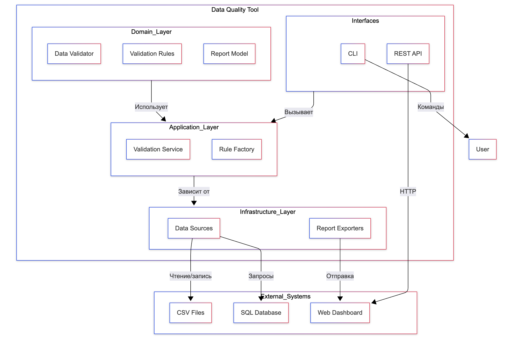
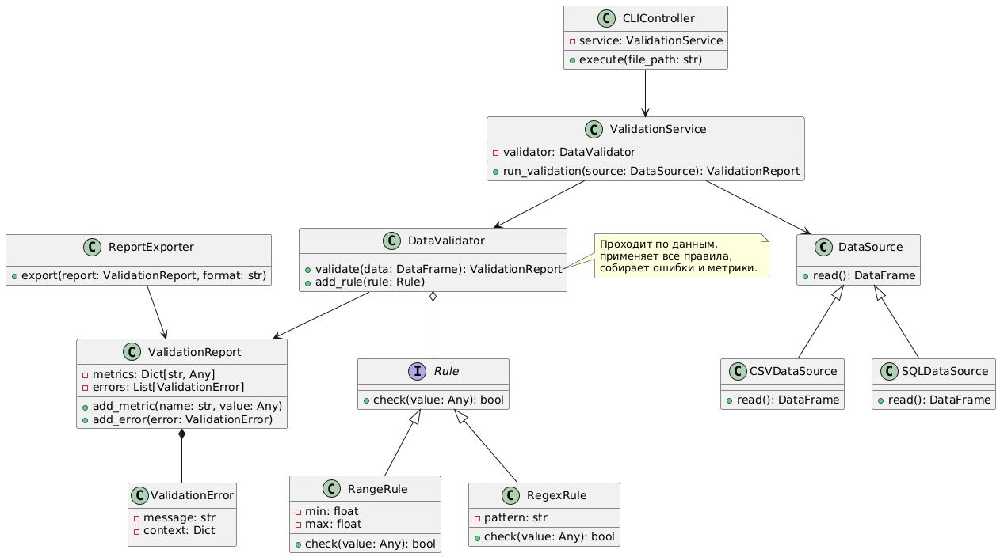
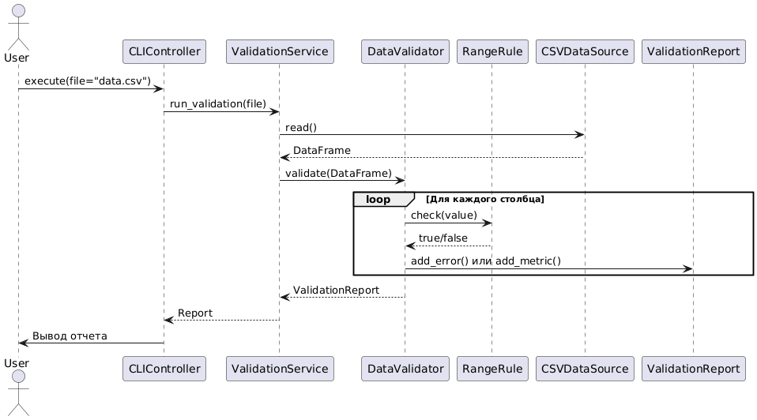
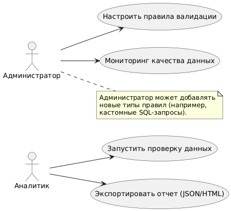

# Data Quality Framework

## Профессиональная платформа для обеспечения качества данных

## Содержание
- [О проекте](#о-проекте)
- [Архитектура](#архитектура)
- [Функциональность](#функциональность)
- [Технологический стек](#технологический-стек)
- [Документация](#документация)

---

## О проекте

DQT - это комплексное решение для обеспечения качества данных в современных data pipelines. Платформа предоставляет:

- **Автоматизированную валидацию** данных по настраиваемым правилам
- **Глубокий анализ** качества данных через расширенные метрики
- **Гибкую систему мониторинга** 
- **Поддержку различных источников** данных (SQL, NoSQL, файловые хранилища)

Проект разработан с использованием принципов Domain-Driven Design для обеспечения максимальной гибкости и масштабируемости.

---

## Архитектура

Система построена по принципам Onion Architecture с четким разделением на доменные слои:

### Ключевые компоненты:
1. **Ядро системы (Domain Layer)**
   - Модели данных и бизнес-правила
   - Механизмы валидации и расчета метрик
   - Система отчетности и нотификаций

2. **Сервисный слой (Application Layer)**
   - Оркестрация процессов проверки
   - Управление правилами валидации
   - API для интеграции

3. **Инфраструктурный слой**
   - Адаптеры для работы с различными источниками данных
   - Экспортеры отчетов
   - Система кэширования

---

## Функциональность

### Основные возможности:
- **Проверка данных** по встроенным правилам
- **Профилирование** данных с расчетом метрик
- **Исторический анализ** изменений качества

---

## Технологический стек

### Основные технологии:
| Категория       | Технологии                          |
|----------------|-----------------------------------|
| Язык          | Python 3.10+                      |
| Фреймворки    | FastAPI, Pandas, SQLAlchemy       |
| Валидация     | Pydantic, Great Expectations      |
| Хранение      | PostgreSQL, Redis                 |
| Визуализация  | Plotly, Vega                      |

### Интеграции:
- **Источники данных**: CSV, JSON, Parquet, SQL(NoSQL) Databases
---

## Документация

Полная документация проекта включает:  
- Диаграмма классов  
  
- Диаграмма последовательностей  
  
- Диаграмма состояний  
.png)  
- Use Cases  
  

